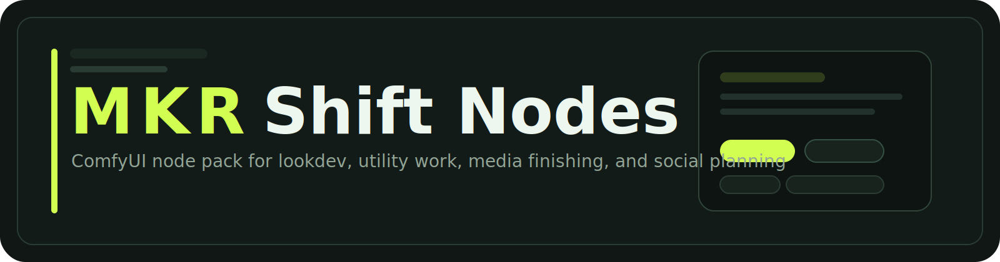

<p align="center">
  
</p>

<p align="center">
  Creative direction, look development, masking, media finishing, and social planning nodes for ComfyUI.
</p>

<p align="center">
  Built for day-to-day production workflows: fast iteration, stronger previews, and practical utility nodes that reduce graph clutter.
</p>

## Overview

MKRShift Nodes is a broad ComfyUI node pack focused on image craft and workflow speed. It combines creative tools, utility nodes, custom frontend helpers, and social-planning nodes in one pack instead of splitting related tasks across multiple small installs.

## Node Areas

| Area | Example Nodes | Focus |
| --- | --- | --- |
| Direction | `MKRCharacterCustomizer`, `AngleShift`, `Aspect1X`, `AxBCompare` | Character setup, angle exploration, compare views, and framing |
| Color + Lookdev | `xLUT`, `xLUTOutput`, `x1ColorWheels`, `x1Curves`, `x1PaletteMap` | LUT authoring, grading, color matching, and look building |
| Image Processing | `x1Bloom`, `x1Film`, `x1Stylize`, `x1LocalContrast`, `x1SharpenPro` | Finishing, texture, stylization, and polish |
| Mask + Utility | `x1MaskGen`, `AdvResize`, `xShader`, `x1DenoiseDetail` | Mask generation, resize work, shader utilities, and cleanup |
| PreSave + Media | `MKRPreSave`, `MKRPresaveVideo`, `MKRPresaveAudio`, `MKRMuxVideoAudio`, `MKRTrimVideoByTime` | Preview-first export helpers plus audio/video utility work |
| Social Planning | `MKRshiftSocialPackBuilder`, `MKRshiftSocialPackAssets`, `MKRshiftSocialPromptAtIndex`, `MKRshiftSocialPackCatalog` | Pack-driven captions, prompts, scheduling, and social asset planning |

## Frontend Extensions

This pack ships custom `WEB_DIRECTORY` extensions for nodes that benefit from a better UI:

- `MKRCharacterCustomizer`
- `AngleShift`
- `AxBCompare`
- `MKRPreSave`
- `MKRPresaveVideo`
- `MKRPresaveAudio`
- `MKRshiftSocialPackBuilder`
- `xLUT`
- `x1MaskGen`

Markdown help pages for these nodes live in `web/docs/`.

## Installation

1. Clone or copy this folder into `ComfyUI/custom_nodes/`.
2. Restart ComfyUI.
3. Install `ffmpeg` if you plan to use the video/audio export and muxing nodes.

## Notes

- `pyproject.toml` is included so the pack has a stable package identity.
- Repository URL, license, and `PublisherId` are intentionally still unset until real publishing details exist.
- The code uses relative imports and does not rely on the install folder matching the repo name.
- Social pack presets are loaded from `packs/`.

## Verification

Run the test suite with:

```bash
python3 -m unittest discover -s tests -p 'test_*.py'
```

The current checks cover:

- pack importability
- exported node metadata
- `WEB_DIRECTORY` presence
- docs and packaging assets
- social and mask feature regressions
